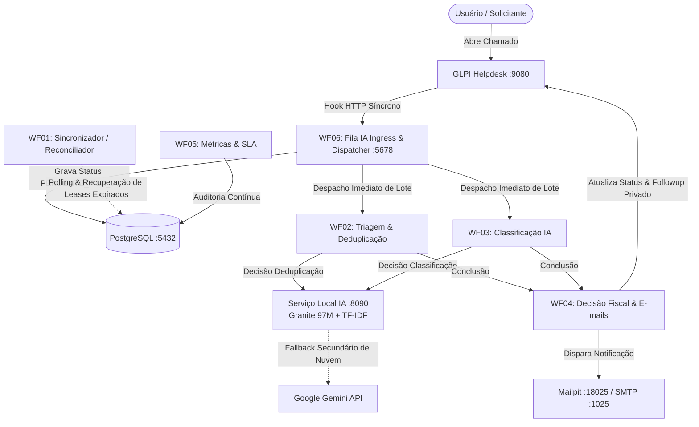

# 📋 Guia Oficial de Implantação, Configuração e Validação — Arquitetura V9

**Projeto:** Automação Inteligente de Triagem e Classificação de Chamados GLPI com Múltiplos Modelos de IA  
**Instituição de Referência:** IF Sudeste MG - Campus Rio Pomba  
**Versão da Arquitetura:** V9 (Microsserviços Orientados a Eventos com 6 Workflows n8n)  
**Status do Sistema:** Protótipo Avançado / Validação Técnica Conclu## 1. Visão Geral da Arquitetura V9

A arquitetura V9 desacopla a recepção de chamados do processamento de inteligência artificial através de uma fila transacional assíncrona em PostgreSQL com garantia de concorrência (`SKIP LOCKED` e *advisory locks*). O plugin do GLPI executa um webhook HTTP síncrono que alimenta a fila assíncrona do WF06:



---

## 2. Pré-Requisitos do Sistema

### 2.1 Hardware Recomendado
* **CPU:** 4 núcleos x86_64 (mínimo) / 8 núcleos (recomendado).
* **Memória RAM:** 8 GB (mínimo) / 16 GB (recomendado para concorrência de workflows).
* **Armazenamento:** 20 GB de espaço livre em disco SSD.

### 2.2 Dependências de Software
* **Docker Engine** (v24.0+) e **Docker Compose** (v2.20+).
* **Python** 3.11 ou 3.12 (64-bit) com `pip` e `venv`.
* **PowerShell** 7+ (Windows) ou **Bash** (Linux/macOS).

---

## 3. Preparação do Ambiente e Segredos

### 3.1 Clonagem e Criação do Ambiente Virtual Python
```powershell
# 1. Navegar até a raiz do projeto
cd c:\Users\Cayo\Documents\projeto-ic

# 2. Criar e ativar o ambiente virtual isolado
python -m venv .venv
.\.venv\Scripts\Activate.ps1

# 3. Instalar as dependências pinadas de desenvolvimento e IA
pip install -r requirements.txt
pip install -r local_ai/requirements-hybrid.txt
```

### 3.2 Configuração dos Arquivos de Ambiente (.env)
Copie os arquivos de exemplo para inicializar a configuração local:

```powershell
# Configuração do n8n e banco PostgreSQL
Copy-Item n8n\.env.example n8n\.env
Copy-Item n8n\.env.local.example n8n\.env.local

# Configuração do GLPI e banco MariaDB
Copy-Item glpi\.env.example glpi\.env
```

> [!WARNING]
> **Segurança de Credenciais:**  
> Substitua todos os valores marcados como `CHANGE_ME` nos arquivos `.env` locais (senhas de banco, `GLPI_APP_TOKEN`, `GLPI_AUTH_BASIC`, `IA_LOCAL_API_TOKEN` e `WEBHOOK_AUTH_KEY`). Os arquivos `.env` e `.env.local` são estritamente ignorados pelo `.gitignore` e nunca devem ser versionados no Git.

---

## 4. Inicialização dos Contêineres Docker

O ecossistema opera sobre 5 contêineres Docker distribuídos em redes isoladas:

```powershell
# 1. Subir banco de dados MariaDB e GLPI
docker compose -f glpi/docker-compose.yml up -d

# 2. Subir banco PostgreSQL, n8n e Mailpit
docker compose -f n8n/docker-compose.yml up -d

# 3. Validar se todos os 5 contêineres estão operacionais e saudáveis
docker ps --format "table {{.Names}}\t{{.Status}}\t{{.Ports}}"
```

### Portas e Interfaces Padrão:
* **GLPI Helpdesk:** `http://localhost:9080` (credenciais em `glpi/.env`)
* **n8n Automation:** `http://localhost:5678` (credenciais em `n8n/.env`)
* **Mailpit Web UI:** `http://localhost:18025` (SMTP interno na porta `1025`)
* **PostgreSQL:** `localhost:5432` (banco de triagem, filas e proveniência)
* **MariaDB:** Rede interna isolada do Docker (acessível exclusivamente pelo GLPI)

---

## 5. Inicialização do Serviço Local de IA (PyTorch FP32)

O runtime local de inferência executa o modelo **IBM Granite 97M Multilingual R2 + TF-IDF** em CPU sem dependências externas:

`powershell
# Em uma janela dedicada do PowerShell:
.\local_ai\scripts\start-local-ai.ps1
`

O inicializador executa as seguintes validações antes de liberar a porta 8090:
1. Validação de integridade SHA-256 do bundle (local_ai/artifacts/local_hybrid_manifest.json).
2. Aquecimento do backend PyTorch FP32 (dimensão 384).
3. Verificação do token de autenticação IA_LOCAL_API_TOKEN.

Para verificar o status ou encerrar o serviço:
`powershell
.\local_ai\scripts\status-local-ai.ps1
.\local_ai\scripts\stop-local-ai.ps1
`

---

## 6. Compilação Determinística e Deploy dos 6 Workflows V9

Os workflows n8n são mantidos em Python Builders determinísticos (uild_wf01.py a uild_wf06.py). O comando abaixo compila os JSONs canônicos, valida os hashes criptográficos e realiza a publicação automática no n8n via API REST:

`powershell
python n8n/workflows/Versão9/deploy.py
`

### Lista de Workflows V9 Implantados:
* V9 - WF01 Sincronizador: Despacho e controle transacional de concorrência.
* V9 - WF02 Triagem: Deduplicação vetorial e semântica de chamados.
* V9 - WF03 Classificação: Categorização em 4 classes e registro de followup privado no GLPI.
* V9 - WF04 Decisão Fiscal: Encaminhamento de parecer e notificações.
* V9 - WF05 Métricas & SLA: Auditoria e telemetria de operação.
* V9 - WF06 Fila IA: Ingress assíncrono via webhook com Rate Limiting Adaptativo.

---

## 7. Suíte Completa de Verificação e Testes

Execute a validação em múltiplos níveis para garantir conformidade antes de qualquer operação:

`powershell
# 1. Testes Unitários e Contratos do Runtime Local (57 testes)
python -m unittest discover -s local_ai/tests -p "test_*.py"

# 2. Testes de Avaliação e Metodologia Científica
python -m unittest discover -s avaliacao/tests -p "test_*.py"

# 3. Validação Estática de Segurança e Workflows n8n (mais de 100 asserções de integridade)
python n8n/workflows/Versão9/validate_v9_static.py

# 4. Benchmark de Robustez Adversarial e Ruído Caótico
python local_ai/scripts/benchmark_robustez.py

# 5. Smoke Test de Interfaces Web (Playwright)
python avaliacao/scripts/testar_interfaces_web.py
`

---

## 8. Diretrizes de Hardening para Produção

Para transição do ambiente de laboratório/desenvolvimento para operação institucional:
1. **Isolamento de Segredos:** Armazenar chaves em cofre seguro (ex.: HashiCorp Vault, AWS Secrets Manager) em vez de arquivos .env em disco.
2. **Hardening do n8n:** Habilitar N8N_SECURE_COOKIE=true, ativar sandbox de execução e restringir o acesso a variáveis de ambiente por nós de código.
3. **Hardening do Plugin GLPI:** Transicionar o envio de webhooks para o modelo *Outbox Assíncrono* com assinatura criptográfica X-Webhook-Signature: HMAC-SHA256(timestamp + payload).
4. **Governança de Dados:** Não exportar dados de chamados reais sem protocolo de anonimização e aprovação institucional prévia.
