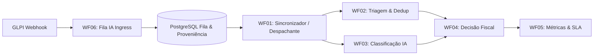

# Automação Inteligente de Triagem e Classificação de Chamados GLPI com Múltiplos Modelos de IA

[]()
[-0.9520-blue)]()
[-success)]()
[-%E2%89%A4%202.30%25-brightgreen)]()
[-orange)]()

Este repositório contém o sistema de engenharia e pesquisa científica para automação de triagem, deduplicação e classificação de chamados de infraestrutura e manutenção predial (GLPI) no contexto do **IF Sudeste MG - Campus Rio Pomba**.

O sistema adota uma arquitetura **local-first** de alta rastreabilidade: a inferência prioritária é executada localmente em CPU (PyTorch FP32) com o modelo híbrido **IBM Granite 97M Multilingual R2 + TF-IDF (n-grams de caracteres 3-5 e palavras) + Classificador Linear Calibrado**, orquestrado por microsserviços orientados a eventos no **n8n (V9)** com persistência transacional em **PostgreSQL** e redundância em nuvem (**Google Gemini 3.5 Flash / 2.5 Flash**) com políticas determinísticas de abstenção conservadora.

---

> [!IMPORTANT]
> **Nota de Governança Científica e Estado da Validação:**  
> Os resultados reportados abaixo foram obtidos em **corpus sintético de desenvolvimento** via validação cruzada agrupada por núcleos semânticos (OOF) e avaliação exploratória reservada. A versão operacional de referência congelada no pipeline é a **`v1.8.0`**; candidatos experimentais (**`v1.9.1`**) permanecem em avaliação técnica. A **validação confirmatória final com dados institucionais intocados e gabarito duplo-cego adjudicado por especialistas humanos encontra-se em preparação** (`confirmatory_claim_allowed=false`).

---

## 📊 Métricas de Desempenho e Avaliação Metodológica

### 1. Classificação Supervisionada (Validação Cruzada OOF — 5 Dobras Agrupadas)
* **Estrutura Amostral do Corpus de Desenvolvimento:** O conjunto total possui 2.800 registros sintéticos. Após a aplicação dos critérios formais de elegibilidade do pipeline, a avaliação classificatória *Out-of-Fold* (OOF) compreendeu **1.114 registros elegíveis agrupados em 230 núcleos semânticos independentes** (garantindo ausência de vazamento de paráfrases entre dobras).
* **Macro-F1 (OOF):** **0.9520** | **Acurácia Global (OOF):** **95.51%**
* **Desempenho por Classe Operacional:**
  * `OBRA` (DDI/DG): **F1 = 0.9739** (Precisão: 97.82%, Recall: 96.97%)
  * `DEMO` (Manutenção Interna): **F1 = 0.9610** (Precisão: 95.30%, Recall: 96.91%)
  * `SOB_DEMANDA` (Contratos Especializados): **F1 = 0.9557** (Precisão: 95.70%, Recall: 95.43%)
  * `TRIAGEM_MANUAL` (Abstenção Segura): **F1 = 0.9174** (Precisão: 92.53%, Recall: 90.96%)

### 2. Segurança Operacional e Análise de Risco Assimétrico
* **Erro Crítico (Manutenção $\to$ OBRA):** **0 ocorrências observadas** na amostra de 129 grupos expostos. Pela regra de sucessão de Laplace / Regra de Três para eventos raros com zero falhas, o Limite Superior de Confiança unilateral de 95% é **$\text{UCB}_{95} \approx 2.30\%$** (o risco populacional real não é assumido como 0%).
* **Deduplicação de Chamados:** **0 Falsos Negativos** observados no benchmark sintético balanceado (1.000 pares / 200 grupos; $\text{NPV}_{\text{amostral}} = 1.0000$; $\text{UCB}_{95} \approx 2.95\%$). *Ressalva:* o NPV populacional no ambiente de produção depende da taxa de prevalência real de duplicidades no GLPI.

### 3. Avaliação Reservada Exploratória (Risk–Coverage & Abstenção)
* Em avaliação exploratória com 700 unidades amostrais:
  * **Cobertura Automática Direta:** **8.29%** (decisões conclusivas sem intervenção).
  * **Acurácia Seletiva:** **100.00%** (zero erros no subconjunto automatizado).
  * **Roteamento para Triagem Humana:** **92.29%** (abstenção conservadora por baixa confiança, ambiguidade ou limiares de segurança).
  * *Implicação para Hipótese H4 (Redução de Trabalho Humano):* A taxa de redução do trabalho do fiscal no GLPI é proporcional à cobertura automática segura. A expansão dessa cobertura exige calibração contínua da curva *risk–coverage*.

### 4. Discriminação de Latência em 3 Camadas
* **Camada 1 — Microbenchmark do Modelo Local:** **143.9 ms (mediana)** em CPU padrão (tempo puro de vetorização e inferência linear).
* **Camada 2 — Serviço REST `local_ai`:** **~414 ms (média)** / **838 ms (p95)** (incluindo validação de schemas, gates determinísticos e proveniência).
* **Camada 3 — Pipeline E2E Integrado (GLPI $\to$ Webhook $\to$ n8n $\to$ Postgres $\to$ GLPI):** **~2.570 ms (p50)** / **5.911 ms (p95)** em ambiente assíncrono controlado.

### 5. Robustez Adversarial e Resiliência a Ruído Tipográfico
* **Taxa de Bloqueio de Prompt Injection:** **100% de neutralização** nas 5 famílias de injeção avaliadas no benchmark sintético controlado (`local_ai/scripts/benchmark_robustez.py`), assegurada por *sanitizers* determinísticos e isolamento de campos do ticket.
* **Resiliência a Ruído:** Manutenção de Macro-F1 $\ge 0.90$ sob perturbações fonéticas e ruído severo de digitação QWERTY.

---

## 🏛️ Arquitetura do Sistema (Versão 9)



### Os 6 Workflows V9 do n8n:
1. **WF01 (Sincronizador):** Polling controlado, despacho transacional e renovação de leases com `SKIP LOCKED`.
2. **WF02 (Triagem):** Deduplicação par-a-par via modelo local híbrido com fallback para Gemini.
3. **WF03 (Classificação):** Categorização em 4 classes com controle de limiares assimétricos de risco e geração de notas de *follow-up* privadas estruturadas (com métricas de confiança) no GLPI.
4. **WF04 (Decisão Fiscal):** Encaminhamento administrativo, aprovação orçamentária e disparo de e-mails.
5. **WF05 (Métricas):** Consolidação de telemetria, SLA e disponibilidade de provedores.
6. **WF06 (Fila IA):** Webhook ingress assíncrono com *advisory locks*, isolamento de falhas externas e Rate Limiter Adaptativo SQL baseado em latência.

---

## 📚 Documentação Técnica e Científica

A documentação completa do projeto encontra-se organizada na pasta [`docs/`](file:///c:/Users/Cayo/Documents/projeto-ic/docs/):

1. 📄 [**Guia de Implantação e Validação V9**](file:///c:/Users/Cayo/Documents/projeto-ic/DEPLOYMENT_AND_VALIDATION_V9.md): Guia oficial e unificado para subida da infraestrutura V9, seed do GLPI, compilação dos workflows e verificação.
2. 📄 [**Diagnóstico de Validação Científica**](file:///c:/Users/Cayo/Documents/projeto-ic/docs/diagnostico_validacao_cientifica.md): Análise de poder estatístico, suficiência amostral, testes pareados (Wilcoxon/McNemar) e protocolo de avaliação.
3. 📄 [**Evolução da Arquitetura (V1 a V9)**](file:///c:/Users/Cayo/Documents/projeto-ic/docs/evolucao_arquitetura_v1_v9.md): Histórico da transição de workflows monolíticos síncronos para microsserviços orientados a eventos.
4. 📄 [**Resultados Estatísticos & Comparativo com Google Gemini**](file:///c:/Users/Cayo/Documents/projeto-ic/docs/resultados_estatisticos_e_comparativo_gemini.md): Análise comparativa detalhada de acurácia, latência, custos e disponibilidade.
5. 📄 [**Modelagem de Processos de Negócio (BPMN)**](file:///c:/Users/Cayo/Documents/projeto-ic/docs/processos_bpmn.md): Mapeamento formal dos processos de atendimento AS-IS (manual) e TO-BE (automação híbrida com human-in-the-loop).
6. 📄 [**Justificativa de Override do Candidato de Deduplicação**](file:///c:/Users/Cayo/Documents/projeto-ic/docs/justificativa_override_deduplicacao.md): Fundamentação técnica e prospectiva para seleção do modelo Híbrido Granite + TF-IDF para deduplicação.

---

## ⚡ Guia Rápido de Execução e Testes

Consulte o [**Guia Oficial de Implantação V9**](file:///c:/Users/Cayo/Documents/projeto-ic/DEPLOYMENT_AND_VALIDATION_V9.md) para o passo a passo completo.

```powershell
# 1. Subida dos Contêineres Docker
docker compose -f glpi/docker-compose.yml up -d
docker compose -f n8n/docker-compose.yml up -d

# 2. Compilação e Deploy dos 6 Workflows V9 no n8n
python n8n/workflows/Versão9/deploy.py

# 3. Execução das Suítes de Testes
python -m unittest discover -s local_ai/tests -p "test_*.py"
python -m unittest discover -s avaliacao/tests -p "test_*.py"
python n8n/workflows/Versão9/validate_v9_static.py
python avaliacao/scripts/testar_interfaces_web.py
```

