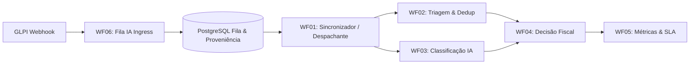

# Automação Inteligente de Triagem e Classificação de Chamados GLPI com Múltiplos Modelos de IA

[]()
[]()
[]()
[]()
[-orange)]()

Este repositório contém o sistema completo de automação e pesquisa científica para triagem, deduplicação e classificação de chamados de manutenção patrimonial e infraestrutura de TI em ambiente universitário (GLPI).

O sistema implementa uma arquitetura híbrida **local-first** de alta confiabilidade: a inferência prioritária é realizada localmente em CPU (PyTorch FP32) com o modelo **IBM Granite 97M Multilingual R2 + TF-IDF + Linear SVM**, contando com orquestração distribuída no **n8n (V9)**, persistência transacional em **PostgreSQL** e redundância em nuvem (**Google Gemini 3.5 Flash**, **Gemini 2.5 Flash** e **DeepSeek**) com **retentativas automáticas e backoff exponencial com jitter**.

---

## 🚀 Destaques de Desempenho (Pipeline V2 - 2.800 Amostras)

* **Macro-F1:** **0.9520** (Acurácia Global: **95.51%** na validação cruzada 5-fold agrupada por núcleo semântico).
* **F1-Score por Classe:**
  * `OBRA`: **0.9739** (Precisão: 97.82%, Recall: 96.97%)
  * `DEMO` (Manutenção Interna): **0.9610** (Precisão: 95.30%, Recall: 96.91%)
  * `SOB_DEMANDA` (Terceirizados): **0.9557** (Precisão: 95.70%, Recall: 95.43%)
  * `TRIAGEM_MANUAL` (Abstenção Segura): **0.9174** (Precisão: 92.53%, Recall: 90.96%)
* **Segurança Operacional:** **0 erros críticos** (0% de chamados de manutenção comum classificados como OBRA).
* **Deduplicação de Chamados:** **0 Falsos Negativos** (NPV = 1.0000) — proteção total contra fechamento indevido de novos chamados.
* **Latência de Inferência Local:** **143,9 ms (mediana)** em CPU padrão (7,8x mais rápido que chamadas remotas de nuvem).
* **Extração de Entidades (NER):** Identificação robusta de Salas, Blocos e Patrimônio, perfeitamente ajustada aos campi do IF Sudeste MG.
* **Robustez Adversarial e Resiliência a Ruído:** Taxa de Bloqueio de 100% contra Injeções de Prompt (Sanitizers Determinísticos). Resiliência comprovada contra perturbações fonéticas e tipográficas severas (QWERTY noise).

---

## 🏛️ Arquitetura do Sistema (Versão 9)



### Os 6 Workflows V9 do n8n:
1. **WF01 (Sincronizador):** Polling controlado e despacho respeitando leases transacionais.
2. **WF02 (Triagem):** Deduplicação par-a-par via modelo local híbrido com fallback para Gemini.
3. **WF03 (Classificação):** Categorização em 4 classes com controle de limiares assimétricos de risco e geração de notas de *follow-up* privadas estruturadas (com métricas de confiança) no GLPI.
4. **WF04 (Decisão Fiscal):** Encaminhamento administrativo, aprovação orçamentária e disparo de e-mails.
5. **WF05 (Métricas):** Consolidação de telemetria, SLA e disponibilidade de provedores.
6. **WF06 (Fila IA):** Webhook ingress assíncrono com *advisory locks*, isolamento de falhas externas e Rate Limiter Adaptativo SQL baseado em latência.

---

## 📚 Documentação Oficial do Projeto

Toda a documentação técnica, científica e tutoriais foram organizados na pasta [`docs/`](file:///c:/Users/Cayo/Documents/projeto-ic/docs/):

1. 📄 [**Diagnóstico de Validação Científica**](file:///c:/Users/Cayo/Documents/projeto-ic/docs/diagnostico_validacao_cientifica.md): Análise de suficiência amostral, poder estatístico, testes pareados (Wilcoxon/McNemar), ablações e adequação metodológica.
2. 📄 [**Evolução da Arquitetura (V1 a V9)**](file:///c:/Users/Cayo/Documents/projeto-ic/docs/evolucao_arquitetura_v1_v9.md): Histórico da transição dos fluxos monolíticos síncronos para microsserviços orientados a eventos.
3. 📄 [**Etapas de Desenvolvimento do Projeto**](file:///c:/Users/Cayo/Documents/projeto-ic/docs/etapas_desenvolvimento_projeto.md): Linha do tempo das 7 macro-etapas de engenharia e pesquisa.
4. 📄 [**Resultados Estatísticos & Comparativo com Google Gemini**](file:///c:/Users/Cayo/Documents/projeto-ic/docs/resultados_estatisticos_e_comparativo_gemini.md): Análise comparativa de acurácia, latência, vazão, custos e disponibilidade.
5. 📄 [**Tutorial Passo a Passo de Reprodução e Implantação**](file:///c:/Users/Cayo/Documents/projeto-ic/docs/tutorial_reproducao_e_implantacao.md): Guia prático de instalação dos contêineres, seed do GLPI, deploy no n8n e execução de testes.
6. 📄 [**Estrutura de Pastas e Glossário de Arquivos**](file:///c:/Users/Cayo/Documents/projeto-ic/docs/estrutura_pastas_e_glossario_arquivos.md): Mapeamento completo e explicação da função de cada arquivo do repositório.

---

## ⚡ Guia Rápido de Execução e Testes

### 1. Subida dos Contêineres
```powershell
docker compose -f glpi/docker-compose.yml up -d
docker compose -f n8n/docker-compose.yml up -d
```

### 2. Deploy dos Workflows no n8n
```powershell
python n8n/workflows/Versão9/deploy.py
```

### 3. Execução da Suíte Completa de Testes
```powershell
# Testes do Runtime Local (56 testes)
python -m unittest local_ai.tests.test_contracts local_ai.tests.test_artifacts_and_extract local_ai.tests.test_hybrid_bundle_embeddings local_ai.tests.test_http_api local_ai.tests.test_pytorch_backend_contract

# Testes de Avaliação Científica (240 testes)
python -m unittest discover -s avaliacao/tests -p "test_*.py"

# Validação Estática dos Workflows n8n (115 asserções)
python n8n/workflows/Versão9/validate_v9_static.py

# Teste em Navegador Real (Playwright - 12 verificações)
python avaliacao/scripts/testar_interfaces_web.py
```
