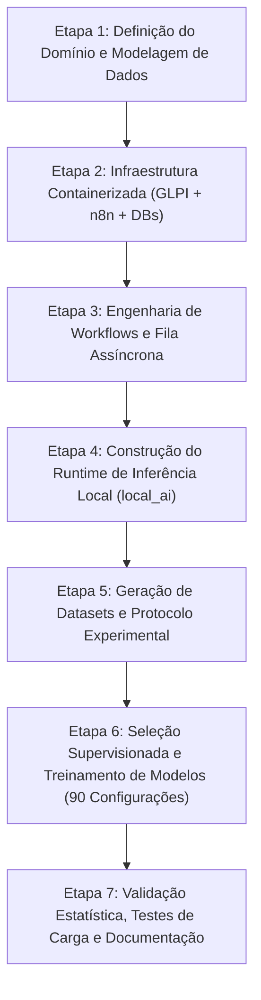

# Etapas de Desenvolvimento do Projeto de Iniciação Científica

**Projeto:** Automação de Triagem e Classificação de Chamados GLPI com Múltiplos Modelos de IA  
**Data:** 18 de Agosto de 2026

---

## 1. Visão Geral das Fases do Projeto

O projeto foi estruturado e executado em **7 macro-etapas**, integrando Engenharia de Software, Ciência de Dados, DevOps e Pesquisa Científica Aplicada.

---

## 2. Detalhamento das Etapas

### Etapa 1: Definição do Domínio, Taxonomia e Modelagem de Dados
1. **Taxonomia Operacional de Chamados:**
   - `OBRA`: Serviços de grande porte, reforma estrutural, alvenaria, instalações complexas. Requer orçamento e aprovação fiscal prévia.
   - `DEMO`: Manutenção predial preventiva/corretiva padrão realizada por equipe interna (elétrica básica, troca de lâmpadas, reparo de fechaduras).
   - `SOB_DEMANDA`: Serviços executados sob demanda por empresas terceirizadas contratadas (refrigeração central, elevadores).
   - `TRIAGEM_MANUAL`: Chamados ambíguos, com descrição insuficiente ou abaixo dos limiares de segurança estatística.
2. **Modelagem de Dados (PostgreSQL Schema V9):**
   - Criação de 15 tabelas relacionais em `database/init_v9.sql`.
   - Separação entre proveniência de execução (`ia_tentativas_modelo`), decisões semânticas consolidadas (`ia_decisoes`), controle transacional de fila (`fila_ia_controle`) e telemetria operacional (`metricas_operacionais`).

### Etapa 2: Infraestrutura Containerizada (DevOps)
1. **Docker Compose GLPI:**
   - Instalação e provisionamento do GLPI 10.x sobre MariaDB 10.11 com *healthchecks*.
   - Configuração do plugin de Webhook e geração de tokens de API REST.
2. **Docker Compose n8n:**
   - Instalação do n8n 2.10.3 conectado a banco PostgreSQL 16 com rede isolada de pesquisa.
   - Configuração de variáveis de ambiente com segregação estrita de credenciais (`.env` vs `.env.local`).
3. **Serviços Auxiliares:**
   - Integração do Mailpit para captura e auditoria de notificações e-mail enviadas pelo GLPI e n8n.

### Etapa 3: Engenharia de Workflows n8n (Arquitetura V9)
1. **Desenvolvimento de Builders Determinísticos em Python:**
   - Criação de scripts `build_wf01.py` até `build_wf06.py` para gerar os workflows JSON de forma reproduzível e auditada com hashes SHA-256 (`SNAPSHOT_SHA256`).
2. **Gateway Multimodelo de IA:**
   - Implementação de nó Code JavaScript com fallback em cadeia: Local (Granite 97M) $\rightarrow$ Primário (Gemini 3.5 Flash) $\rightarrow$ Secundário (Gemini 2.5 Flash) $\rightarrow$ Terciário (DeepSeek).
   - Implementação de retentativas intra-provedor (3x) com *Exponential Backoff* e *Jitter*.
3. **Fila com Tolerância a Concorrência:**
   - Implementação de *advisory locks* e leases no PostgreSQL via WF06.

### Etapa 4: Construção do Runtime de Inferência Local (`local_ai`)
1. **Serviço REST em Python Puro / PyTorch:**
   - Endpoints `/health`, `/v1/classify` e `/v1/deduplicate`.
2. **Carregamento Local de Embeddings:**
   - Integração do modelo `ibm-granite/granite-embedding-97m-multilingual-r2` em FP32 para execução em CPU com baixa pegada de memória (~950 MB RSS) e latência inferior a 150 ms.
3. **Gerenciador de Artefatos Criptográficos:**
   - Validação de integridade via checksum SHA-256 nos manifestos `local_hybrid_manifest.json` e `manifest.json`.

### Etapa 5: Geração de Datasets e Protocolo Experimental
1. **Geração do Corpus Sintético Expandido V2:**
   - Criação do script `gerar_corpus_desenvolvimento_local_v2.py`.
   - Geração de 2.800 registros estruturados (80 núcleos narrativos únicos por classe e 200 episódios de deduplicação) em `desenvolvimento_local_v2.jsonl`.
2. **Protocolo Experimental Frozen:**
   - Especificação formal em `selecao_modelos_supervisionados_v2.json` definindo as 90 configurações, sementes fixas (`SEED = 20260818`) e 5 dobras agrupadas por `narrative_core_sha256`.

### Etapa 6: Seleção Supervisionada de Modelos (90 Configurações)
1. **Treinamento e Avaliação em Larga Escala:**
   - Processamento de 90 combinações (TF-IDF, Granite 97M, E5-Small, MiniLM-L12, Híbridos $\times$ Regressão Logística, Árvores, Linear SVM, MLP, XGBoost).
   - Avaliação Out-of-Fold (OOF) de 93.990 predições.
2. **Determinação do Modelo Vencedor:**
   - `classification__hybrid__granite97m__linear_svm` atingiu **Macro-F1 = 0.9520** e **0 erros críticos**.
3. **Interpretabilidade XAI:**
   - Geração dos valores Shapley com `shap.LinearExplainer`.

### Etapa 7: Materialização, Testes Integrados e Documentação
1. **Materialização do Bundle:**
   - Empacotamento do modelo treinado em `local_ai/artifacts/local_hybrid_bundle.joblib` com manifestos correspondentes.
2. **Baterias de Teste:**
   - 240 testes unitários em `avaliacao/tests/` (100% PASS).
   - 56 testes de contrato em `local_ai/tests/` (100% PASS).
   - 16 testes de gateway (100% PASS).
   - 115 verificações estáticas (100% PASS).
   - 12 testes de interface web via Playwright em navegador real (100% PASS).
3. **Consolidação Documental:**
   - Elaboração dos relatórios técnicos, diagnóstico científico, evolução arquitetural e tutoriais.
