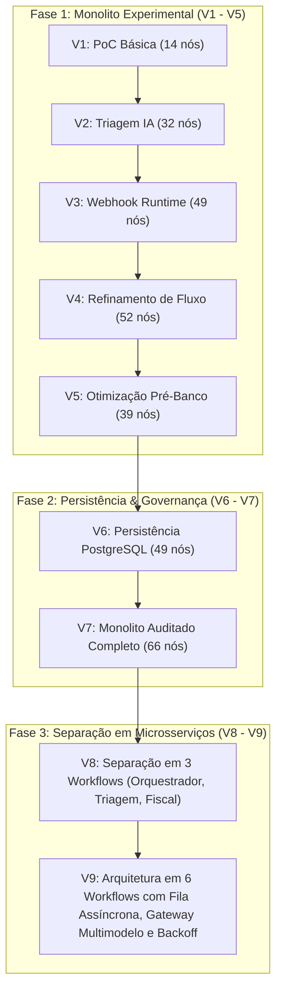
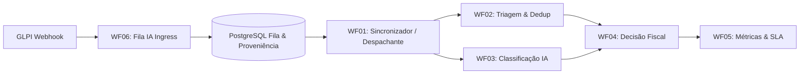

# Evolução da Arquitetura do Sistema: Da Prova de Conceito (V1) aos Microsserviços de Alta Confiabilidade (V9)

**Projeto:** Automação de Triagem e Classificação de Chamados GLPI com Múltiplos Modelos de IA  
**Data de Consolidação:** 18 de Agosto de 2026

---

## 1. Visão Geral da Trajetória Arquitetural

Ao longo do desenvolvimento do projeto, a arquitetura evoluiu através de 9 versões iterativas, transitando de um fluxo monolítico síncrono e frágil para uma arquitetura distribuída, orientada a eventos (*event-driven*), tolerante a falhas, com persistência transacional em PostgreSQL e suporte a múltiplos modelos de IA com contingência automática.

---

## 2. Linha do Tempo e Matriz Comparativa das Versões (V1 - V9)

| Versão | Período | Arquitetura | Nós n8n | Persistência | Gestão de Falhas | Multi-IA / Fallback |
|---|---|---|---:|---|---|---|
| **V1** | Início 2026 | Monolito | 14 | Nenhuma (Memória) | Nenhuma | Apenas OpenAI PoC |
| **V2** | Mar/2026 | Monolito | 32 | Nenhuma | Tratamento básico de erro | OpenAI / Google Gemini |
| **V3** | Mar/2026 | Monolito | 49 | Nenhuma | Retry síncrono no nó HTTP | Gemini Flash |
| **V4** | Abr/2026 | Monolito | 52 | Nenhuma | Timeout fixo | Gemini Flash |
| **V5** | Abr/2026 | Monolito | 39 | Nenhuma | Refatoração de caminhos | Gemini Flash |
| **V6** | Abr/2026 | Monolito | 49 | PostgreSQL | Registro simples de tickets | Gemini Flash |
| **V7** | Abr-Mai/2026 | Monolito | 66 | PostgreSQL | Logs de auditoria | Gemini Flash |
| **V8** | Jun-Jul/2026 | 3 Workflows | ~50 | PostgreSQL | Separação de responsabilidades | Gemini Flash + Local |
| **V9** | **Ago/2026** | **6 Workflows** | **~75** | **PostgreSQL (15 tabelas)** | **Fila assíncrona, Advisory Locks, Retries intra-provedor com Exponential Backoff e Jitter** | **Local-First (Granite 97M) + Gemini 3.5 + Gemini 2.5 + DeepSeek** |

---

## 3. Detalhamento das Fases Evolutivas

### 3.1. Fase 1: Monolitos Iniciais (V1 a V5)
* **Objetivo:** Validar a viabilidade técnica de extrair o texto de chamados abertos no GLPI, enviar a um modelo de linguagem e atualizar a categoria/status no GLPI.
* **Gargalos Identificados:**
  - O fluxo síncrono no webhook travava quando a API de IA sofria latência.
  - Ausência de estado persistente: reinicializações do n8n perdiam chamados em processamento.
  - Mistura de regras de negócio (orçamento fiscal, aprovação de obras) com lógica de integração.

### 3.2. Fase 2: Introdução da Persistência e Governança (V6 e V7)
* **Mudanças Principais:**
  - Introdução do banco de dados relacional (PostgreSQL) para armazenar os chamados recebidos e decisões tomadas.
  - Implementação de regras de deduplicação semântica.
  - V7 tornou-se o maior monolito auditado em produção (66 nós), cobrindo desde o webhook até o disparo de e-mails para fiscais de contrato.
* **Limitações do Monolito V7:**
  - Qualquer alteração na lógica de classificação exigia revalidar todo o fluxo de aprovação fiscal.
  - Erros de rede da API de IA geravam falhas em cascata no fluxo principal.

### 3.3. Fase 3: A Arquitetura V9 (Microsserviços de Alta Confiabilidade)
A versão V9 representou uma reengenharia completa baseada em 4 pilares:

1. **WF06 (Fila IA - Ingress Assíncrono):**
   - Recebe o webhook do GLPI e responde instantaneamente com HTTP 200, gravando o chamado em `fila_ia_controle` com *advisory locks* do PostgreSQL, eliminando perda de dados por contenção de concorrência.
2. **WF01 (Sincronizador & Polling):**
   - Varre a fila respeitando os *leases* transacionais e despacha tarefas sem sobrecarregar as APIs.
3. **WF02 & WF03 (Triagem & Classificação com Gateway Multimodelo):**
   - Executa a política *local-first*: o container local (`local-hybrid` com Granite 97M) processa a inferência em ~140 ms sem custos externos.
   - Em caso de falha transitória ou necessidade de contingência, ativa os modelos de nuvem com até 3 tentativas automáticas e backoff exponencial com jitter.
4. **WF04 (Decisão Fiscal & Encaminhamento):**
   - Aplica a árvore de decisão administrativa (aprovação de obras, triagem manual, fechamento de duplicatas).
5. **WF05 (Métricas Operacionais):**
   - Consolida estatísticas de latência, vazão, taxa de retry e disponibilidade de cada provedor em `metricas_operacionais`.

---

## 4. Ganhos de Engenharia e Confiabilidade da V9

* **Tolerância a Falhas de Rede e Quota:** Com a introdução do loop de retry intra-provedor e backoff exponencial com jitter em `ai_gateway_builder.py`, instabilidades da nuvem (HTTP 429 / 503) não geram interrupção de serviço.
* **Isolamento de Responsabilidades:** Cada workflow possui escopo bem delimitado, facilitando manutenção, testes unitários automatizados e auditoria criptográfica de ponta a ponta.
