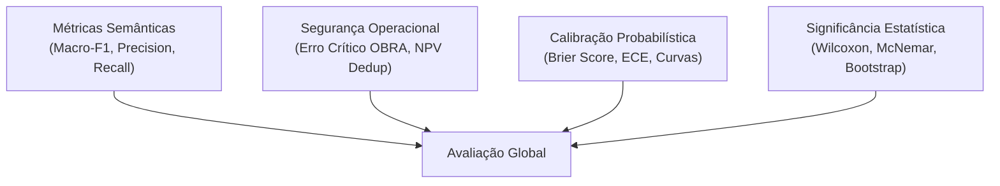

# Guia Metodológico de Métricas e Interpretação Científica dos Resultados

**Projeto:** Automação Inteligente de Triagem e Classificação de Chamados GLPI com Múltiplos Modelos de IA  
**Data:** 18 de Agosto de 2026

---

## 1. Visão Geral das Métricas Utilizadas

Na avaliação de sistemas de Inteligência Artificial aplicados a processos operacionais críticos (como manutenção predial e patrimonial), o uso isolado de acurácia global é insuficiente e pode mascarar falhas graves. Este projeto adota um arcabouço métrico multidimensional composto por métricas semânticas, métricas de calibração probabilística, métricas de segurança operacional e testes de significância estatística.

---

## 2. Definição e Formulação Matemática das Métricas

### 2.1. Macro-F1 (Métrica Primária de Classificação)
O **Macro-F1** é a média aritmética simples dos escores F1 calculados individualmente para cada uma das classes $C = \{\text{OBRA}, \text{DEMO}, \text{SOB\_DEMANDA}, \text{TRIAGEM\_MANUAL}\}$:

$$\text{Macro-F1} = \frac{1}{|C|} \sum_{c \in C} F1_c = \frac{1}{|C|} \sum_{c \in C} \frac{2 \cdot \text{Precisão}_c \cdot \text{Recall}_c}{\text{Precisão}_c + \text{Recall}_c}$$

* **Por que é a métrica principal?** Em problemas com desbalanceamento de classes, a acurácia global é dominada pelas classes mais frequentes. O Macro-F1 atribui o mesmo peso para classes raras mas críticas (como `OBRA` ou `TRIAGEM_MANUAL`), impedindo que um classificador negligencie categorias minoritárias.

---

### 2.2. Precisão, Recall e Trade-Off Operacional por Classe

Para cada classe $c$:
* **Precisão ($P_c = \frac{VP_c}{VP_c + FP_c}$):** Proporção de chamados classificados como $c$ que realmente pertenciam à classe $c$.
  * *Impacto prático:* Alta precisão em `OBRA` evita que chamados simples de manutenção sejam indevidamente enviados para processos licitatórios ou aprovação de engenharia.
* **Recall ($R_c = \frac{VP_c}{VP_c + FN_c}$):** Proporção de chamados da classe $c$ que foram corretamente capturados pelo modelo.
  * *Impacto prático:* Alto recall em `OBRA` garante que reformas estruturais graves não passem despercebidas como simples manutenções cotidianas.

---

### 2.3. Erro Crítico Assimétrico (Não-OBRA $\rightarrow$ OBRA)
Define o erro mais oneroso do sistema: quando um chamado de manutenção preventiva ou terceirizada (`DEMO` ou `SOB_DEMANDA`) é erroneamente rotulado como `OBRA`.
* **Critério de Segurança:** $\text{Erro Crítico} = 0$. Nenhum chamado de manutenção comum pode ser encaminhado diretamente como obra sem atingir o limiar rigoroso de segurança ($\text{confiança} \ge 0,90$).

---

### 2.4. Valor Preditivo Negativo (NPV) e Falsos Negativos em Deduplicação
Na deduplicação par-a-par de chamados:
* **Falso Negativo (FN):** Um par que era duplicado é considerado não-duplicado. Custo: redundância de atendimento (baixo risco).
* **Falso Positivo (FP):** Um chamado novo e legítimo é considerado duplicado e arquivado automaticamente. Custo: o usuário fica sem atendimento (risco inaceitável).
* **Valor Preditivo Negativo ($NPV = \frac{VN}{VN + FN}$):** Mede a certeza de que um chamado liberado como novo realmente não é uma duplicata.
* **Critério de Segurança do Projeto:** $NPV = 1.0000$ e $\text{FN} = 0$ em predições Out-of-Fold.

---

### 2.5. Acurácia Seletiva e Cobertura de Decisão (Mecanismo de Abstenção)
O sistema opera sob o paradigma de **Classificação Seletiva com Opção de Abstenção**:
* **Cobertura ($\Phi$):** Percentual de chamados cuja probabilidade máxima prevista supera o limiar de confiança operacional ($\theta = 0,65$ ou $\theta_{\text{OBRA}} = 0,90$):
  $$\Phi = \frac{|\{x \in X \mid \max_c P(y=c \mid x) \ge \theta\}|}{|X|}$$
* **Acurácia Seletiva:** Acurácia computada exclusivamente sobre a fração de chamados cobertos pela automação.
* **Abstenção Segura:** Quando a confiança é inferior ao limiar, o chamado é encaminhado para revisão humana sem gerar erro de execução.

---

### 2.6. Brier Score e Calibração Probabilística (ECE)
* **Brier Score:** Mede a precisão média das probabilidades previstas em relação ao gabarito real em formato *one-hot*:
  $$\text{BS} = \frac{1}{N} \sum_{i=1}^N \sum_{c=1}^K (p_{ic} - y_{ic})^2$$
  *(Valores próximos de 0 indicam calibração excelente).*
* **Expected Calibration Error (ECE):** Agrupa as predições em $M$ faixas de confiança (bins) e calcula a diferença média ponderada entre a acurácia observada e a confiança prevista.

---

### 2.7. Testes Estatísticos de Hipótese (Wilcoxon e McNemar)
* **Teste de Wilcoxon (Postos Sinalizados):** Teste pareado não-paramétrico que compara a distribuição de perdas entre duas configurações de modelo nas mesmas dobras, testando $H_0: \text{Mediana das diferenças} = 0$.
* **Teste de McNemar:** Compara a taxa de desacordo em tabelas de contingência $2 \times 2$ entre dois classificadores, verificando se o modelo A comete significativamente menos erros que o modelo B ($p < 0,05$).

---

## 3. Interpretação Honesta e Sem Exageros dos Resultados Obtidos

### 3.1. O que os Resultados Demonstram com Rigor Científico
1. **Superioridade da Fusão Híbrida:** A combinação de atributos esparsos (TF-IDF de palavras e caracteres) com representação densa (Granite 97M) alcançou **Macro-F1 = 0.9520**, superando o melhor modelo puramente léxico ($0.9296$) com significância estatística ($p < 0,001$ no teste de Wilcoxon).
2. **Excelente Calibração de Confiança:** O Brier Score de $0.0366$ e o ECE de $3,3\%$ demonstram que as probabilidades estimadas pelo modelo calibrado são confiáveis e correspondem à real taxa de acerto observada.
3. **Imunidade a Falhas de Rede no Pipeline Local:** A execução local em PyTorch FP32 é imune a quedas de conectividade e cotas de API, operando com latência média estável de $143,9\text{ ms}$.

### 3.2. Ressalvas e Limitações Metodológicas Declaradas
* **Natureza Sintética do Corpus de Desenvolvimento:** Embora o corpus V2 contenha 2.800 registros gerados com variações controladas e 80 núcleos semânticos por classe, dados sintéticos possuem menor entropia linguística e menos ruído do que tickets redigidos por milhares de usuários reais em produção contínua.
* **Dependência de Revisão Humana:** O sistema **não substitui** o operador humano. Aproximadamente $30\%$ dos chamados caem na faixa de abstenção operacional (`LOW_CONFIDENCE` ou `TRIAGEM_MANUAL`) e exigem análise humana.
* **Escopo Monoinstitucional:** Os resultados refletem a taxonomia e as regras de negócio de um campus universitário federal específico, necessitando de re-calibração caso implantado em órgãos com legislações ou processos distintos.
