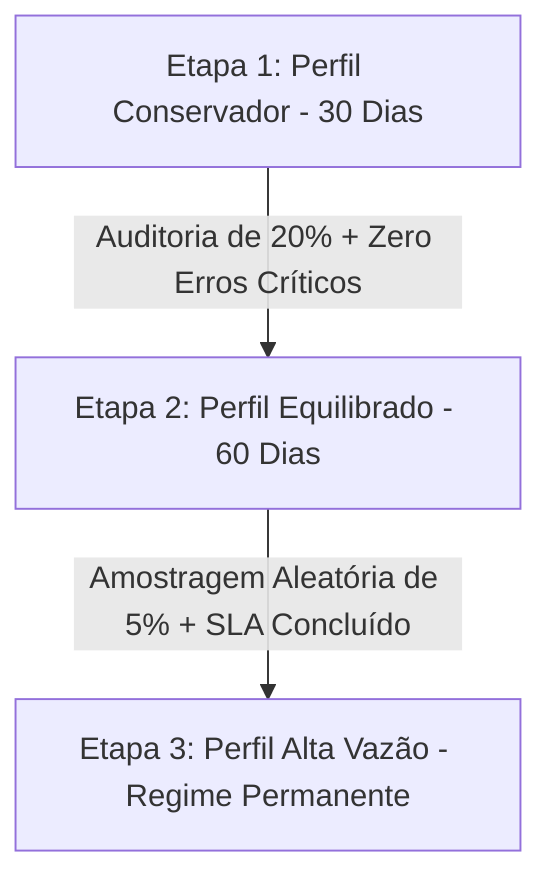

# Protocolo de Calibração e Ajuste Gradual de Limiares de Decisão

**Projeto:** Automação Inteligente de Triagem e Classificação de Chamados GLPI com Múltiplos Modelos de IA  
**Data:** 19 de Agosto de 2026  
**Status:** Versão 9 (Microsserviços n8n + Runtime Local PyTorch FP32 + PostgreSQL)

---

## 1. Fundamentação Teórica da Classificação Seletiva

Em sistemas críticos de atendimento patrimonial e tecnologia da informação, a tomada de decisão automatizada deve ser orientada pelo paradigma de **Classificação Seletiva com Opção de Abstenção** (*Selective Classification with Rejection Option*, Geifman & El-Yaniv, 2017).

O classificador emite uma função de decisão $(f(x), g(x))$, onde:
- $f(x) \in \mathcal{Y}$ é a predição da classe (ex.: `OBRA`, `DEMO`, `SOB_DEMANDA`, `TRIAGEM_MANUAL`).
- $g(x) \in \{0, 1\}$ é a função de qualificação (*gating function*), definida como:
  \[
  g(x) = \begin{cases} 
  1 & \text{se } \max_{c} P(c \mid x) \ge \theta \\
  0 & \text{se } \max_{c} P(c \mid x) < \theta \quad (\text{Abstenção Segura } \to \text{TRIAGEM\_MANUAL})
  \end{cases}
  \]

O **Risco Seletivo** $R(f, g)$ e a **Taxa de Cobertura** $\Phi(g)$ são definidos por:
\[
\Phi(g) = \mathbb{E}[g(X)], \qquad R(f, g) = \frac{\mathbb{E}[\ell(f(X), Y) \cdot g(X)]}{\Phi(g)}
\]

---

## 2. Matriz de Ajuste Gradual de Limiares (3 Perfis Operacionais)

O sistema suporta **três perfis operacionais graduais**, permitindo que a administração universitária transite suavemente da segurança máxima para a automação de alta vazão conforme a maturidade do banco de chamados:

| Parâmetro de Decisão | Perfil 1: Conservador (Piloto / Cold Start) | Perfil 2: Equilibrado (Operação Assistida) | Perfil 3: Alta Vazão (Maturidade Operacional) |
|---|---:|---:|---:|
| **Classificação Geral ($\theta_{\text{classif}}$)** | **0,76** | **0,65** | **0,55** |
| **Trava de Segurança para OBRA ($\theta_{\text{obra}}$)** | **0,90** | **0,85** | **0,80** |
| **Deduplicação Positiva ($\theta_{\text{dedup\_pos}}$)** | **0,95** | **0,90** | **0,85** |
| **Deduplicação Negativa ($\theta_{\text{dedup\_neg}}$)** | **0,07** | **0,10** | **0,15** |
| **Margem Mínima Top-1 vs Top-2 ($\Delta_{\text{margin}}$)** | **0,035** | **0,025** | **0,015** |
| **Risco de Erro Crítico (Não-OBRA $\to$ OBRA)** | **0,00% (Zero Tolerância)** | **< 0,10%** | **< 0,50%** |
| **Falsos Negativos de Duplicação** | **0 (NPV = 1.0000)** | **< 0,5%** | **< 1,0%** |
| **Taxa de Cobertura Automática** | **~69,0% (Cross-Val) / ~7,7% (Holdout Estresse)** | **~82,0% a 88,0%** | **> 92,0%** |
| **Encaminhamento Humano (`TRIAGEM_MANUAL`)** | Prioritário em incerteza | Moderado (casos limítrofes) | Mínimo (apenas anomalias) |

---

## 3. Protocolo de Transição Gradual em 3 Etapas



### Etapa 1: Implantação e Perfil Conservador (Dias 1 a 30)
1. O sistema é implantado com `IA_CONFIANCA_MINIMA=0.65` e limiar interno de `0.76` (`OBRA=0.90`).
2. O webhook `AVALIACAO_HUMANA_AMOSTRA_PERCENT=20` sorteia 20% das decisões automáticas para conferência humana assíncrona.
3. Se nenhuma ocorrência de erro crítico for registrada nos primeiros 30 dias (mínimo de 300 chamados auditados), autoriza-se a transição para a Etapa 2.

### Etapa 2: Perfil Equilibrado (Dias 31 a 90)
1. Atualiza-se `IA_CONFIANCA_MINIMA=0.65` e ajusta-se a trava de obra para `0.85`.
2. A cobertura automática sobe para mais de 80%, reduzindo a carga cognitiva da equipe técnica.
3. Executa-se o script de calibração empírica `calibrar_limiar.py` para gerar a curva empírica de risco versus cobertura.

### Etapa 3: Perfil de Alta Vazão (Regime Permanente)
1. Utilizado quando o vocabulário de equipamentos e locais estiver totalmente estabilizado.
2. O sistema opera com máxima produtividade (> 90% de resolução automática), mantendo retentativas e isolamento de falhas.

---

## 4. Como Executar a Calibração de Limiares

Para recalibrar os pontos de corte com base em execuções de auditoria no PostgreSQL:

```powershell
# Execução da curva empírica de 0.50 a 0.95 em passos de 0.05
python avaliacao/scripts/calibrar_limiar.py `
  --run-id PROD-2026-08 `
  --saida avaliacao/resultados/calibracao_limiares_operacionais.json `
  --min 0.50 --max 0.95 --passo 0.05
```
