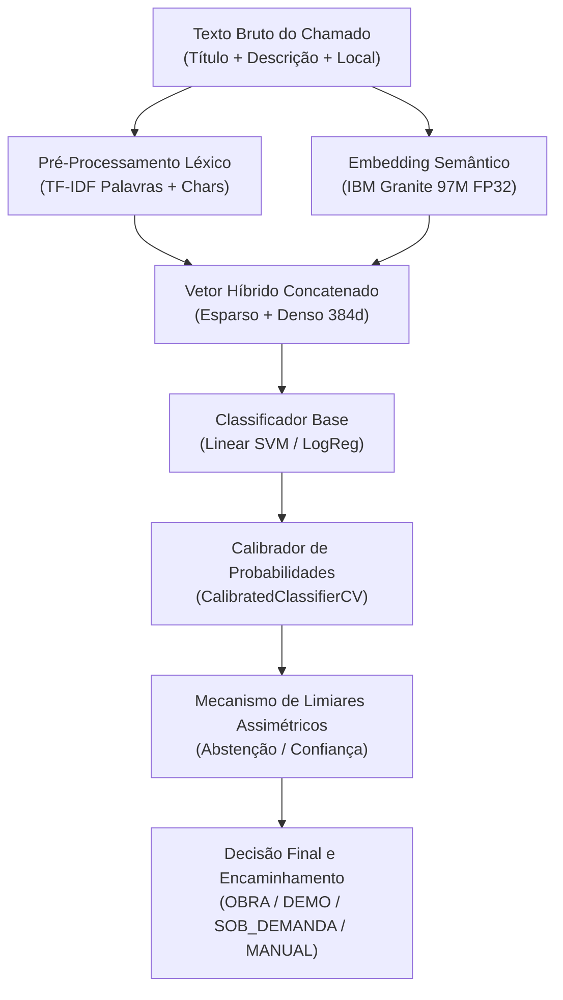

# Processo Detalhado de Treinamento e Funcionamento da Inteligência Artificial

**Projeto:** Automação de Triagem e Classificação de Chamados GLPI com Múltiplos Modelos de IA  
**Data:** 18 de Agosto de 2026

---

## 1. Visão Geral do Pipeline de Treinamento e Inferência

O pipeline de Inteligência Artificial do projeto foi projetado para operar com alta precisão semântica e baixa latência de inferência em CPU (FP32), utilizando uma arquitetura híbrida que combina extração léxica esparsa e extração semântica densa.

---

## 2. Etapa 1: Pré-Processamento e Engenharia de Atributos

### 2.1. Extração Léxica (TF-IDF Esparso)
* **TF-IDF de Palavras:** Extração de unigramas e bigramas com ponderação sublinear de frequência de termo (`sublinear_tf=True`), limite de frequência mínima (`min_df=2`) e remoção de *stopwords* customizadas para manutenção predial.
* **TF-IDF de Caracteres:** Extração de n-gramas de caracteres (faixa de 3 a 5 caracteres) para conferir robustez contra erros ortográficos, abreviações técnicas ("lab", "ar-cond", "qd") e variações morfológicas.

### 2.2. Extração Semântica Densa (IBM Granite 97M)
* **Modelo Base:** `ibm-granite/granite-embedding-97m-multilingual-r2`.
* **Dimensão:** Vetor de 384 dimensões em ponto flutuante de precisão simples (FP32).
* **Pooling:** *Mean pooling* sobre os tokens de saída da última camada do transformador, seguido de normalização L2 euclidiana ($\|v\|_2 = 1$).
* **Execução:** Otimizado em PyTorch puro para execução local na CPU, sem necessidade de GPU em produção.

### 2.3. Fusão Híbrida de Atributos
Os vetores de atributos léxicos ($X_{\text{tfidf}} \in \mathbb{R}^{d_1}$) e os vetores semânticos densos ($X_{\text{embed}} \in \mathbb{R}^{384}$) são concatenados em uma matriz esparsa balanceada:

$$X_{\text{híbrido}} = [X_{\text{tfidf}} \;\|\; X_{\text{embed}}]$$

Essa fusão permite que o classificador explore simultaneamente termos de alta especificidade (códigos de salas, equipamentos) e o sentido semântico global da narrativa.

---

## 3. Etapa 2: Formulação Algorítmica e Treinamento dos Modelos

Durante a seleção supervisionada, foram testadas 5 famílias de classificadores:

### 3.1. Linear SVM (Máquinas de Vetores de Suporte Linear) - *Modelo Campeão*
Minimiza a função de perda *Hinge Loss* com regularização L2:

$$\min_{w, b} \frac{1}{2} \|w\|^2 + C \sum_{i=1}^N \max(0, 1 - y_i (w^T x_i + b))$$

* **Por que venceu:** Alta capacidade de generalização em espaços de alta dimensionalidade gerados pela fusão de TF-IDF e embeddings, mantendo separabilidade linear nítida com margem máxima de segurança e baixíssimo custo computacional de inferência.

### 3.2. Regressão Logística Multinomial com Regularização L2
Utilizada como classificador e como modelo campeão na tarefa de deduplicação par-a-par:

$$P(y = c \mid x) = \frac{e^{w_c^T x + b_c}}{\sum_{j=1}^K e^{w_j^T x + b_j}}$$

* **Vantagem:** Estimativas de probabilidade suaves e convexidade garantida na otimização.

### 3.3. MLP (Multi-Layer Perceptron / Rede Neural)
* Rede neural feedforward com 2 camadas ocultas (128 e 64 neurônios), função de ativação ReLU e regularização por decaimento de peso (*weight decay*).

### 3.4. XGBoost e Árvores de Decisão
* Modelos baseados em árvores com particionamento por ganho de informação (Gini/Entropia) e gradiente boosting.

---

## 4. Etapa 3: Validação Cruzada 5-Fold Estratificada e Agrupada

Para evitar qualquer risco de vazamento de dados (*data leakage*):
1. **Agrupamento Semântico:** Todos os 2.800 registros do corpus V2 possuem um identificador criptográfico de núcleo (`narrative_core_sha256`).
2. **Isolamento de Grupos:** Nenhuma paráfrase ou variação de um mesmo núcleo pode aparecer simultaneamente no conjunto de treinamento e no conjunto de validação de uma mesma dobra.
3. **Estratificação por Classe:** Todas as dobras mantêm a mesma proporção equilibrada entre as classes `OBRA`, `DEMO`, `SOB_DEMANDA` e `TRIAGEM_MANUAL`.

---

## 5. Etapa 4: Calibração de Probabilidades e Limiares Operacionais

### 5.1. Calibração Pós-Treinamento (Platt Scaling / Isotonic Regression)
Como as margens do Linear SVM não representam probabilidades calibradas naturalmente, aplicou-se o `CalibratedClassifierCV` com calibração sigmoide em validação cruzada interna de 5 dobras.

### 5.2. Otimização de Limiares com Custos Assimétricos
Os limiares de corte foram otimizados numericamente sobre as predições Out-of-Fold (OOF):
* **Classificação Geral:** $\theta = 0,65$ (confiança mínima para automação).
* **Segurança Reforçada para OBRA:** $\theta_{\text{OBRA}} = 0,90$ (exige evidência contundente para evitar custos indevidos).
* **Deduplicação Par-a-Par:** Limiar positivo $\theta_{\text{dedup}} = 0,95$ e margem de tolerância $\Delta = 0,035$.

---

## 6. Etapa 5: Empacotamento Criptográfico e Runtime de Produção

O modelo campeão foi empacotado no artefato binário [`local_ai/artifacts/local_hybrid_bundle.joblib`](file:///c:/Users/Cayo/Documents/projeto-ic/local_ai/artifacts/local_hybrid_bundle.joblib), contendo:
* O vetorizador TF-IDF ajustado;
* O pipeline de transformação de embeddings;
* O classificador Linear SVM calibrado;
* O modelo de deduplicação por Regressão Logística;
* O mapa de limiares calibrados e metadados de treinamento.

A integridade do arquivo é verificada em tempo de execução através do checksum SHA-256 declarado no manifesto [`local_hybrid_manifest.json`](file:///c:/Users/Cayo/Documents/projeto-ic/local_ai/artifacts/local_hybrid_manifest.json), garantindo total imutabilidade e rastreabilidade em ambiente produtivo.
